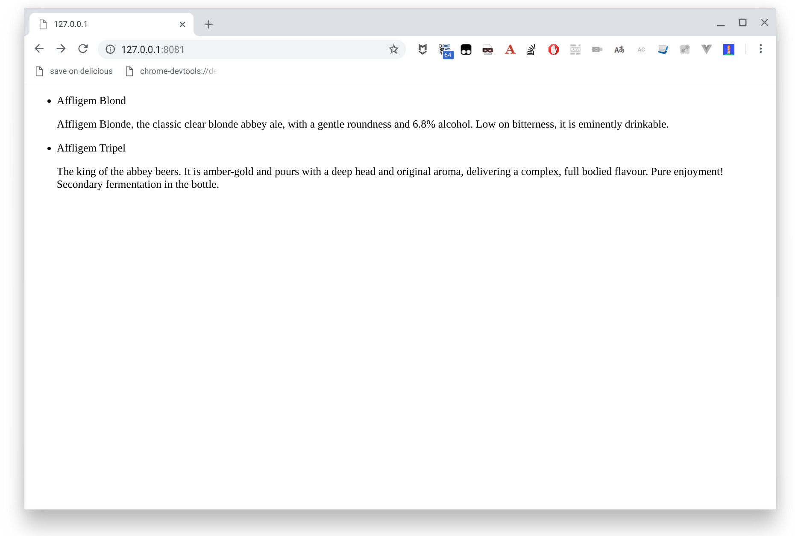

#  LitElement Beers - LitElement tutorial - Step 01

This is the initial step of the tutorial. In this step you won't need to code, everything is already coded for you.

Remember, to see the app running in a browser, open a separate terminal/command line tab or window, go to the project directory and then start the web server. Now, open a browser window for the app and navigate to http://localhost:8000/app/ to see the current state of the app.

In order to illustrate how Polymer enhances standard HTML, you will create a purely static HTML page and then examine how we can turn this HTML code into a template that Polymer will use to dynamically display the same result with any set of data.

In this step you will add some basic information about two beers to an HTML page.

## The structure of the app ##

You will be mainly using three folders: 

- An `app` folder with your code. As you can see, the `app` folder have several sub-folders:

    - `app/css`: the stylesheets for the app.
    - `app/elements`: here you will find the definition of the custom LitElement elements used in the tutorial
    - `app/data`: a folder to serve the static data (that would be replaced by a REST entrypoint in a real world application), with a sub-folder:
      - `app/data/beers`: a service endpoint with all the information about our beer collection. It will be used in the later steps of the tutorial.
    - `app/npm`: a folder to store dependencies recovered via `npm`
    - `app/web_modules`: a folder where [`@pika/web`](https://github.com/pikapkg/web) transform the dependencies in order to run them directly from the browser 

## Dependencies

LitElement uses `npm` to manage dependencies. All the dependencies have been included in the git repository in the `node_modules` folder, so in order to run the tutorial fully offline just copy it to your `app` folder.

## What must I do?

Add the beer information to the `app/index.html` file:

    

      <ul>
        <li>
          Affligem Blond
          
Affligem Blonde, the classic clear blonde abbey ale, with a gentle roundness and 6.8% alcohol. Low on bitterness, it is eminently drinkable.

        </li>
        <li>
          Affligem Tripel
          
The king of the abbey beers. It is amber-gold and pours with a deep head and original aroma, delivering a complex, full bodied flavour. Pure enjoyment! Secondary fermentation in the bottle.

        </li>
      </ul>
    

You can point your browser to `http:/127.0.0.1:8000/` to see your file:

## Additional experiments

Try adding more static HTML to `app/index.html`. For example:

    
Total number of beers: 2

## Summary

We have done an app skeleton for a beers app. To begin adding dynamism, go to [step-02](../step-02).    
